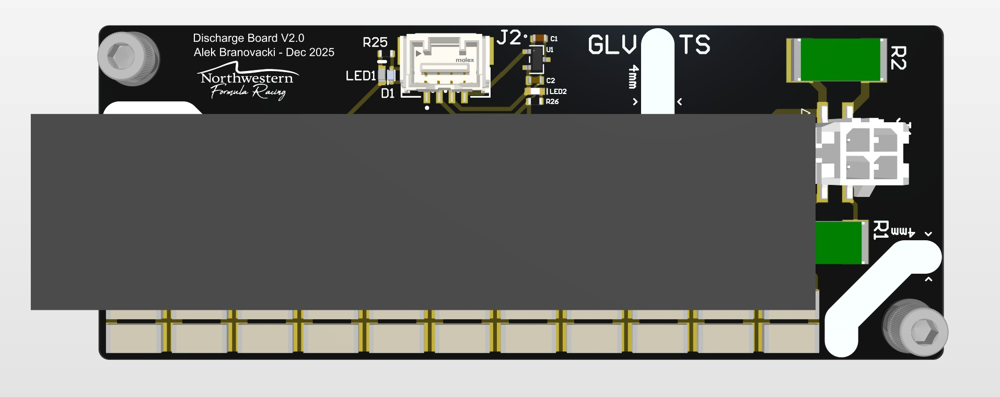
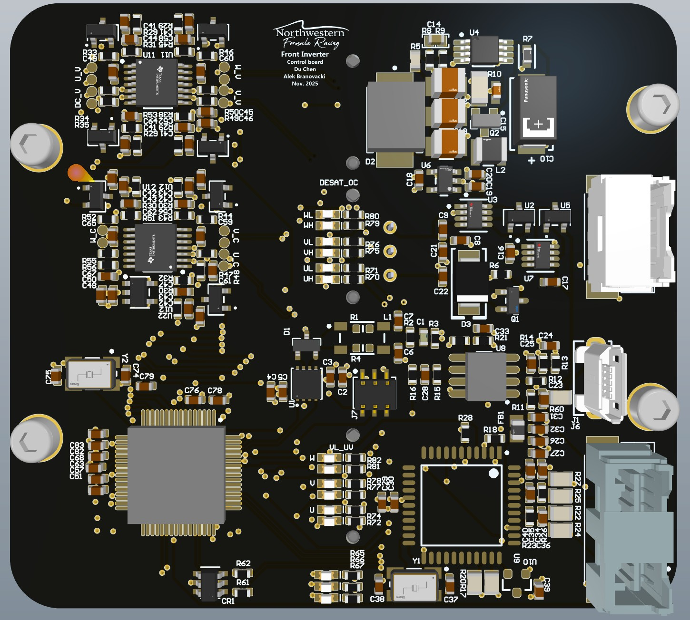

## Discharge Boards
### Discharge V1
I did both the schematic and layout of this simple discharge board as my first project for NFR. This board is integrated into our battery charger system and discharges the bulk capacitors in the charger's power supply when charging is complete or interrupted. The board uses an 11s2p resistor chain and relay to safely bleed off stored energy from the charger's internal capacitors before disconnecting.
### Discharge V2

In the second version of the discharge board, I added a linear regulator as this board went in our HV box to discharge our main DC link capacitor. The regulator provides stable control power from the high-voltage bus.

## Daughterboards

The daughterboards are a critical component of the High Voltage Battery Management System (HV BMS), responsible for monitoring and balancing the battery cells in the accumulator pack. I completed the PCB layout and routing for these boards, while the schematic design was done by Drake Vogelpohl, the HV team lead.

## Rear Inverter
### Control Board

I assisted Du Chen with the PCB layout and routing of the control board for the custom front hub motor inverter. The control board is one layer in our three-board stackup design and manages gate drive signals, current/voltage sensing, and communication for our SiC-FET-based three-phase motor drive system.
